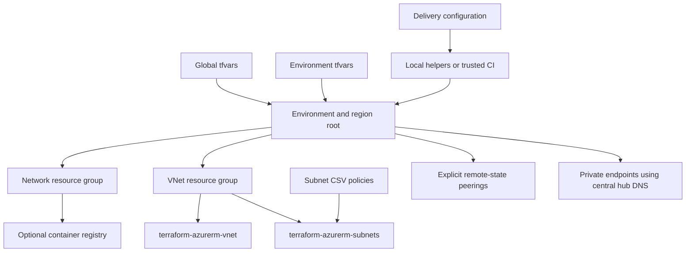

# Azure network foundation

[](https://github.com/MikeeeGit/azure-network-foundation/actions/workflows/ci.yml)

Deploy repeatable Azure networks using environment/region configuration, CSV network policies and shared Terraform delivery workflows.

This is the public edition of **AZ-TF-azvdc**. It retains the original direct VNet/subnet module composition, naming conventions, two resource groups, hub/spoke topology, central private DNS, optional private endpoints and ACR. All included configuration is synthetic. Apache-2.0 licensed.

## Start here

1. Follow the [from-zero Azure setup guide](https://github.com/MikeeeGit/terraform-delivery-templates/blob/v0.2.0/docs/getting-started.md) to bootstrap state storage and configure identities.
2. Clone this repository and [terraform-delivery-templates](https://github.com/MikeeeGit/terraform-delivery-templates).
3. Replace the synthetic tenant/subscription IDs and choose globally unique storage names in `delivery.azure.json`. Set matching workload IDs in `config/global.tfvars`.
4. Update the explicit remote-state coordinates in each environment's `remote_networks` to match those backend names.
5. Review [configuration](docs/configuration.md), the CSVs and [deployment order](docs/deployment.md) before planning.

Terraform **1.16.3** is the tested CLI; the configuration supports Terraform >=1.9,<2 and AzureRM >=4.33,<5. Provider checksums are committed.

```bash
git clone https://github.com/MikeeeGit/terraform-delivery-templates.git
git clone https://github.com/MikeeeGit/azure-network-foundation.git
cd azure-network-foundation
az login --tenant <your-tenant-id>
source ../terraform-delivery-templates/scripts/azure/terraform-functions.sh
tf_setup azure-network-foundation hub uks
tf_init
tf_plan
tf_apply
```

PowerShell exposes the same commands by dot-sourcing `scripts/azure/terraform-functions.ps1`. The helpers resolve delivery configuration, verify targeting, use the global/environment tfvars in order, save plans and prompt before apply. See the shared guide for CI service connections, federation and Windows/WSL setup.

The public repository's own CI runs credential-free validation and mocked tests. Authenticated plan/apply examples are intended for a private deployment copy with its own state and identities.

## Architecture



The separate [network composition module](https://github.com/MikeeeGit/terraform-azurerm-network-foundation) is available to other consumers. This stack retains direct calls to the [VNet](https://github.com/MikeeeGit/terraform-azurerm-vnet) and [subnet](https://github.com/MikeeeGit/terraform-azurerm-subnets) modules.

## Included examples

For the complete worked topology, start with [hub and two spokes, dual-AKS subnets, private DNS and optional firewall egress](examples/hub-spoke/README.md). The baseline configurations below remain available.


| Region | Environment | Subscription alias | VNet example |
|---|---|---|---|
| uks / UK South | hub | hub | 10.60.0.0/16 |
| uks / UK South | pprd | pprd | 10.61.0.0/16 |
| uks / UK South | prd | prd | 10.62.0.0/16 |
| ukw / UK West | hub | hub | 10.70.0.0/16 |
| ukw / UK West | bcdr | prd | 10.71.0.0/16 |

The examples preserve the original five-target/26-subnet configuration shape with newly authored policy data. They create subnet reservations for gateway/firewall services; they do not deploy those services. Review DNS zone costs and any optional services before applying.

## Capabilities

- Convention-derived names and independent network/VNet resource groups.
- Global defaults with environment overrides; any Azure region with an explicit short code.
- CSV-driven NSGs and routes, logical subnet outputs and reserved Azure subnet names.
- Public/private DNS zones and A/CNAME/MX records, private DNS links, custom DNS and optional DDoS association.
- Explicit multi-subscription/region peering topology and a first-deployment phase.
- Central hub DNS for private endpoints, with optional spoke zone links.
- Optional ACR, including Premium georeplication.
- Optional Log Analytics diagnostics; no embedded estate workspace.

## Documentation and validation

- [Configuration and CSV policy](docs/configuration.md)
- [Deployment order and daily operations](docs/deployment.md)
- [GitHub/Azure DevOps deployment caller examples](examples/delivery/README.md)
- [Public-copy provenance and compatibility](docs/migration.md)
- [Publishing and two-host workflow](docs/publishing.md)
- [Change log](CHANGELOG.md)

```bash
terraform fmt -check -recursive
terraform init -backend=false
terraform validate
terraform test
```

Tests use mock providers and overridden remote-state data. They do not prove Azure permissions, real provider API behavior or a live deployment. A sandbox deployment should be recorded separately when performed.

Public source: [GitHub](https://github.com/MikeeeGit/azure-network-foundation). Matching repository: [Azure DevOps](https://dev.azure.com/Mrmichaelflynn/AzureInfraCode/_git/azure-network-foundation), which requires project access.
