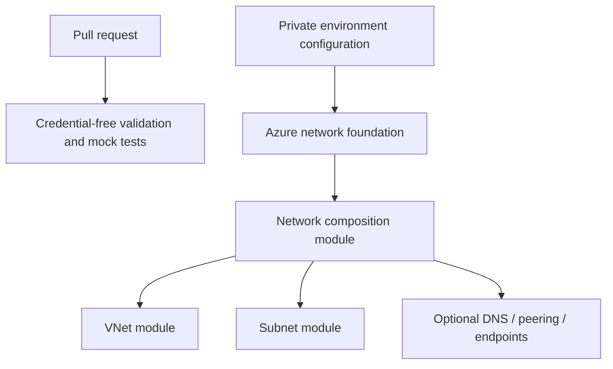

# Azure network foundation

[](https://github.com/MikeeeGit/azure-network-foundation/actions/workflows/ci.yml)

An example deployment of reusable Azure networking modules, with separate state and configuration for each environment. It creates a resource group and a virtual network, explicit subnets, optional NSGs/routes, private DNS, local-side peering and private endpoints.

This project demonstrates Terraform module design and delivery through GitHub Actions and Azure Pipelines. All committed environment values are synthetic. The public CI checks run without Azure credentials.

## Repository family

| Repository | Responsibility |
| --- | --- |
| [terraform-delivery-templates](https://github.com/MikeeeGit/terraform-delivery-templates) | Reusable validation and delivery building blocks for GitHub Actions and Azure Pipelines; Azure and AWS authentication examples |
| **azure-network-foundation** | Environment-facing Azure deployment, provider and backend configuration |
| [terraform-azurerm-network-foundation](https://github.com/MikeeeGit/terraform-azurerm-network-foundation) | Composition of network features |
| [terraform-azurerm-vnet](https://github.com/MikeeeGit/terraform-azurerm-vnet) | Focused virtual network module |
| [terraform-azurerm-subnets](https://github.com/MikeeeGit/terraform-azurerm-subnets) | Typed subnet, NSG, route and delegation configuration |



## Validate without a subscription

Requires the Terraform version in `.terraform-version`.

```sh
terraform fmt -check -recursive
terraform init -backend=false -lockfile=readonly
terraform validate
terraform test
```

The tests use mocked providers. No cloud deployment, routing, egress, private endpoint connectivity or DNS resolution is implied by a passing result.

## Deploy your own environment

Use a private deployment repository/project for real inputs, state, plan output and artifacts. Never enable cloud credentials in public pull-request jobs.

1. Bootstrap a dedicated Azure Storage state backend with Microsoft Entra authentication, least-privilege blob access, state locking, recovery controls and suitable network restrictions. Register the resource providers used by your configuration.
2. Configure a scoped workload identity for CI, or sign in locally with Azure CLI. Set `ARM_SUBSCRIPTION_ID` explicitly. The backend may use a separate subscription; supply its ID in backend config.
3. Copy `environments/example.tfvars.example` and `environments/backend.azurerm.hcl.example` to ignored local files and replace the synthetic names/CIDRs.
4. Initialize and create a saved plan:

```sh
terraform init -reconfigure -backend-config=environments/backend.azurerm.hcl
terraform plan -lock-timeout=5m -var-file=environments/dev.tfvars -out=network.tfplan
# Review the plan in the same private workspace before this explicit action:
terraform apply network.tfplan
```

State locking stays enabled. Plans can contain sensitive values; keep them private and short-lived. Use a unique backend key per environment and serialize deployments to each key. Choose non-overlapping CIDRs with your IPAM policy. Optional private DNS, endpoints, diagnostics and DDoS association can incur charges. Workload outbound connectivity is explicit; this stack does not provision a NAT Gateway or firewall.

## Design and scope

[variables.tf](variables.tf) is the full configuration contract. Names, tags and regions are caller supplied; the implementation has no assumptions about a particular organisation or subscription.

This is a redesigned successor to AZ-TF-azvdc, not a state-compatible rename. See [migration notes](docs/migration.md) before considering an existing deployment. ACR, public DNS, firewalls, gateways and tenant bootstrap remain separate concerns. Multi-subscription hub/spoke composition requires explicit provider aliases and reciprocal peering ownership; the starter deploys one network in one subscription.

GitHub is the public collaboration host. Azure Repos is a private counterpart: Microsoft has retired creation of new public Azure DevOps projects and will convert existing public projects during 2027. See [Microsoft's retirement notice](https://learn.microsoft.com/en-us/azure/devops/organizations/projects/public-projects-retirement?view=azure-devops).

## Contributing and licence

See [CONTRIBUTING.md](CONTRIBUTING.md) and [SECURITY.md](SECURITY.md). Licensed under [Apache-2.0](LICENSE).
