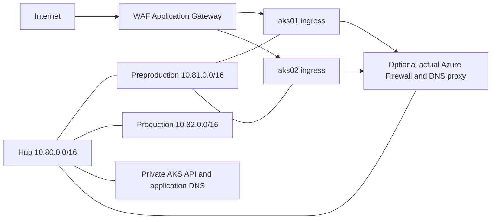

# Complete hub and two-spoke example

This configuration pack extends the deployment root into a connected hub, preproduction spoke and production spoke. It includes both AKS cluster subnets in each spoke, a dedicated Application Gateway subnet, central private DNS, CSV network policy and a separately deployed [Azure Firewall egress add-on](egress/README.md).

The two clusters are independent deployment slots inside one spoke; the two spokes are separate environments. This does not replicate applications, databases or cluster state between regions.

## Topology and ownership

| Network | Subnet | Prefix | Owner/use |
|---|---|---|---|
| hub | GatewaySubnet | 10.80.0.0/24 | Reservation; no VPN/ExpressRoute gateway is deployed |
| hub | AzureFirewallSubnet | 10.80.1.0/26 | Firewall deployed only by the egress add-on |
| hub | shared | 10.80.2.0/24 | Shared-service reservation |
| pprd | aks01 / aks02 | 10.81.0.0/22 / 10.81.4.0/22 | Independent private AKS clusters |
| pprd | appgateway | 10.81.8.0/24 | Dedicated WAF_v2 Application Gateway |
| pprd | private-endpoints / services | 10.81.9.0/24 / 10.81.10.0/24 | Optional workloads |
| prd | same five subnet keys | Corresponding 10.82.* ranges | Separate production environment |

Each environment has its own network state and two resource groups. Each state owns its local peering side. The hub owns central private DNS zones; spoke states own their links. The egress add-on owns its firewall, AKS route tables and their associations. AKS and Application Gateway use separate repositories and states.

Peering alone does not provide spoke-to-spoke transit. The add-on supplies explicit routes and firewall rules for the supported flows. It does not force Application Gateway traffic through the firewall. See [Microsoft hub/spoke routing](https://learn.microsoft.com/en-us/azure/firewall/firewall-multi-hub-spoke).

## 1. Prepare a private consumer

Use a new private copy of this repository and new state. This pack changes address spaces and subnet names relative to the basic configuration; copying it over an existing deployment requires a separate reviewed migration.

From the private consumer root:

    cp -R examples/hub-spoke/config/. config/
    cp examples/hub-spoke/delivery.azure.json delivery.azure.json

PowerShell equivalent:

    Copy-Item examples/hub-spoke/config/* config/ -Recurse -Force
    Copy-Item examples/hub-spoke/delivery.azure.json delivery.azure.json

Update synthetic IDs in both global tfvars and delivery.azure.json. Choose globally unique backend names and update every remote_networks backend. If you renamed the consumer repository, update its state keys too. These examples select only uks/hub, uks/pprd and uks/prd; the separate UK West baseline remains an optional later design.

Follow the [shared bootstrap guide](https://github.com/MikeeeGit/terraform-delivery-templates/blob/v0.2.0/docs/azure/bootstrap.md) before initializing remote state. Keep private configuration, state and plans out of the public source.

## 2. Create networks and DNS, then peer them

Keep enable_peerings=false. Apply the hub first, followed by pprd and prd. For each target use the normal helper sequence, review the saved plan, then approve that target's apply:

    source ../terraform-delivery-templates/scripts/azure/terraform-functions.sh
    tf_setup azure-network-foundation hub uks
    tf_init
    tf_plan
    tf_apply

Repeat with pprd and prd. If your private repository has another name, use that name in tf_setup.

After all three states exist, set enable_peerings=true in their reviewed configuration files and repeat plan/apply for hub, pprd and prd. Check all four peering directions report Connected.

The hub creates internal.example, privatelink.uksouth.azmk8s.io, and private-link zones for Key Vault, ACR and Blob Storage. Both spokes link these zones even when no private endpoint exists. The default Azure DNS path works with these links; custom DNS needs explicit forwarding or the add-on's DNS proxy.

## 3. Choose explicit AKS egress

The base pack has header-only route CSVs. It neither creates a fictional firewall next hop nor supplies general Internet egress on its own.

For the complete inspected-egress example, deploy [egress](egress/README.md) after peering with enable_aks_routes=false. This creates the firewall and route tables before attaching them. Its routes reference the actual newly created firewall private IP and apply only to aks01/aks02. Leave their route CSVs empty so two states never compete for subnet associations.

Set both spoke VNet DNS server lists to the created firewall private IP and reapply the network states before creating clusters. The firewall's DNS proxy must be able to resolve all private zones used by clients; link any separately owned application alias zone to the hub too. Then set enable_aks_routes=true in the egress state, review and apply the associations, and verify DNS and egress from a private test host. Follow the add-on's connectivity checks before setting the AKS UDR-ready acknowledgement.

Alternatively, use the AKS repository's explicit load-balancer egress configuration and omit the firewall add-on. Do not select userDefinedRouting without a functioning route and egress service.

Azure Firewall and its public IP incur charges while deployed. The demonstration capacity and outbound rules need workload-specific sizing, SNAT-capacity review and registry exceptions before production use.

## 4. Deploy dual AKS and a WAF gateway

Use the public AKS and Application Gateway examples linked from the [scenario guide](https://github.com/MikeeeGit/terraform-delivery-templates/blob/v0.3.0/docs/azure/hub-spoke-platform.md). Both use the same subnet keys and address plan.

Export the selected network's subnet_ids, subnet_address_prefixes and vnet outputs. Obtain the hub's managed_private_dns_zone_ids output for its private AKS API zone. Prefer explicit reviewed resource IDs; remote-state readers also gain access to the underlying state and need blob permissions.

For the illustrative pprd pair, reserve internal ingress addresses 10.81.0.20 and 10.81.4.20 in the corresponding AKS subnets. The infrastructure modules do not install an ingress controller or create application Services. Deploy and verify an explicitly internal ingress endpoint in each cluster before pointing the gateway at it.

Create the gateway only after its backend, certificate secret, identity access, DNS and probe settings are ready. Keep gateway subnet routing separate from AKS UDRs. The CSV permits HTTP/HTTPS clients, the GatewayManager control-plane range and Azure Load Balancer probes, with Internet outbound for this public/private frontend baseline. Other default NSG rules still apply; the example is not a complete workload isolation policy.

Choose the active cluster through an explicit backend pool or a gateway-owned private DNS alias. Validate the inactive cluster and gateway health before cutover, retain the previous cluster for rollback, and account for DNS caching, connection draining and application/database compatibility. No automatic blue/green migration or data replication is claimed.

## 5. Verify and remove deliberately

From a host with private access, verify central DNS, private AKS API access, each ingress endpoint, gateway backend health and a request through the public listener. Check that AKS subnet routes use the actual firewall, Application Gateway retains its intended egress, and unexpected inter-spoke traffic is denied by the policy.

For removal, remove workloads/gateway dependencies first. Remove AKS clusters before their route associations or DNS paths. Remove egress, disable and remove both peering directions while every network state is still available, then remove spoke and hub networks. Never delete state to force this order.

## Credential-free checks

From the repository root:

    terraform init -backend=false
    terraform test
    terraform test -test-directory=tests/hub-spoke -var-file=examples/hub-spoke/config/global.tfvars -var-file=examples/hub-spoke/config/uks/hub/hub.tfvars

Repeat the last command for pprd/prd. CI runs all three configurations and the independent egress tests. These are mocked plans; they do not establish real connectivity, tenant permissions or a live deployment.
