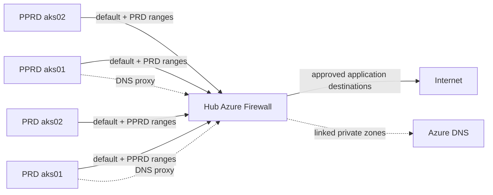

# Optional Azure Firewall egress for the four AKS subnets

This standalone Terraform root adds a real Standard Azure Firewall, Standard public IP and Firewall Policy with DNS proxy to the [hub/spoke network pack](../README.md). It prepares one route table for each of the two dedicated AKS subnets in PPRD and PRD. Every next hop comes from the created firewall's computed private address.

It uses a separate backend key and explicit `azurerm.hub`, `azurerm.pprd` and `azurerm.prd` provider aliases. Network states continue to own VNets, subnets, NSGs, peering and DNS links. This state owns the firewall, policy, four route tables and their optional associations. It does not create AKS clusters, Application Gateway, a gateway or a DNS resolver VM.



## Inputs and state ownership

Copy `terraform.tfvars.example` to ignored `terraform.tfvars`. Replace all synthetic IDs with outputs from your existing network deployments. Terraform does not discover production subscriptions or select an ambient subscription for the workload providers.

| Input | Source |
|---|---|
| `hub.subscription_id` | Actual hub workload subscription |
| `hub.resource_group_name` | Hub `vnet-rg` output, or another existing hub resource group for the firewall |
| `hub.firewall_subnet_id` | Hub `subnet_ids["AzureFirewallSubnet"]` |
| `pprd/prd.subscription_id` | Corresponding spoke workload subscription |
| `pprd/prd.resource_group_name` | Corresponding `vnet-rg` output, or an existing resource group in that subscription for its route tables |
| `pprd/prd.vnet_id` | Corresponding `vnet_id` output |
| `pprd/prd.address_space` | Corresponding `vnet.address_space` output |
| `pprd/prd.aks_subnets.aks01/aks02.id` | Corresponding `subnet_ids["aks01"]` / `["aks02"]` |
| `pprd/prd.aks_subnets.aks01/aks02.address_prefix` | Corresponding `subnet_address_prefixes` entry |

Use the actual CIDRs alongside those IDs; the policy sources and opposite-spoke routes depend on them. The sample uses hub `10.80.0.0/16`, PPRD `10.81.0.0/16` and PRD `10.82.0.0/16`. The AKS subnet maps accept only `aks01` and `aks02` and reject an Application Gateway subnet passed under an AKS key.

The network pack's AKS route CSVs must stay header-only. A subnet supports one route table association, so do not also create these associations in its CSV module, the AKS root or another state. The firewall subnet and Application Gateway subnet get no route table from this add-on. Use separate state keys for separate deployments; never reuse a network or cluster state key.

## Deployment order

1. Deploy all three network states, enable reciprocal peerings and verify all four directions are Connected. Forwarded traffic must be permitted for firewall transit, as configured in the pack. Confirm there is no overlapping address space and that AKS NSGs permit DNS to the firewall and the required outbound protocols.
2. Review the paid resources and capacity limitations below. Copy `backend.hcl.example` to ignored `backend.local.hcl`, replace its synthetic values, and use a dedicated backend key. Authenticate through the private consumer's approved Azure CLI/OIDC environment. The identity needs network resource permissions in all three workload subscriptions and separate blob access to the backend. These providers use the same authenticated principal; different workload principals require an intentional authentication design.
3. Leave `enable_aks_routes = false`, then initialize, review a saved plan and apply it. This creates the firewall, policy and route tables without changing subnet routes:

   ```sh
   terraform init -backend-config=backend.local.hcl
   terraform plan -out=egress.tfplan
   terraform apply egress.tfplan
   terraform output firewall_private_ip
   ```

4. In the network-root configuration, set the spoke `dns_servers` lists to the returned firewall IP and reapply those network states before creating AKS nodes. Keep DNS ownership there. The firewall uses Azure-provided upstream DNS, so every private zone required by clients must be linked to its hub VNet. This includes the private AKS API zone and any separately owned private application alias zone. Verify UDP and TCP DNS from a private test host and resolve the required private/public names. Do not blindly point the hub's own DNS configuration at itself without considering hub clients and upstream resolution.
5. Set `enable_aks_routes = true`. Review and apply a new saved plan. Inspect effective routes on a temporary test NIC in each dedicated AKS subnet: default traffic and opposite-spoke ranges must use the actual firewall IP. Verify DNS, required HTTPS destinations, image-registry authentication/CDN hosts and expected denied traffic. Remove the temporary probes before cluster creation. Only then set the AKS example's UDR-ready acknowledgement and deploy private clusters with `outbound_type = "userDefinedRouting"`.
6. Pass `route_table_ids.pprd` or `.prd` to the corresponding AKS deployment's network-permission inputs. Its control-plane identity needs the route/subnet permissions required by that cluster design. Recheck cluster bootstrap, node readiness and real image pulls; mocked tests cannot establish connectivity or access rights.

The initial route-free step does not claim that AKS already has working egress. A successful Terraform apply also does not establish application reachability. During removal, destroy AKS workloads/clusters before removing their route associations, firewall or DNS path; remove this add-on before deleting the hub subnet.

## Policy and routing behavior

The default application rule allows AKS platform FQDNs through `AzureKubernetesService` on HTTP/HTTPS, scoped to the four AKS subnet CIDRs. Add explicit registry, authentication and CDN hostnames to `additional_registry_fqdns` when the platform tag does not cover your images. HTTPS registry access is opt-in; an unrestricted `*` is rejected. [Microsoft AKS egress guidance](https://learn.microsoft.com/en-us/azure/aks/limit-egress-traffic).

`allow_cross_spoke_https = false` leaves inter-environment firewall access denied. Enabling it adds two targeted TCP443 rules between the AKS subnet ranges. The opposite-spoke routes exist in both directions to preserve a symmetric firewall path. Peering alone is not transitive. This is transport permission, not application authentication; NSGs, workload network policies, DNS and reachable services still matter. Direct hub/spoke and same-VNet traffic follows its more-specific system routes and is not automatically inspected by this default route.

`allow_legacy_ntp` defaults to false. Current private AKS nodes do not need the older public control-plane ports TCP9000/UDP1194; current nodes also do not need the legacy outbound NTP exception. If required for an explicitly reviewed older node configuration, the option permits only UDP123 to `ntp.ubuntu.com` from the AKS ranges. Check the [current AKS outbound requirements](https://learn.microsoft.com/en-us/azure/aks/outbound-rules-control-egress) for your cloud, cluster version and enabled add-ons.

Private API access follows the linked private DNS/private network path. This example adds no DNAT/public ingress, firewall-public-IP bypass route or broad cross-environment rule. Application Gateway keeps its independent routing. If you later introduce public load balancer ingress, custom upstream DNS, other cloud endpoints or more spokes, review return routes and policy explicitly.

## Cost and production limits

Azure Firewall and the public IP incur charges while deployed, including when no route associations are enabled. This example's single public IP is for demonstration. Production requires current pricing, availability-zone, throughput and SNAT-capacity review; Microsoft recommends planning considerably more frontend capacity for busy AKS estates. Review additional public IPs or supported NAT Gateway integration for your connection patterns. Add monitoring/diagnostic destinations, operational alerts and a tested recovery process to your production design. [Firewall sizing guidance](https://learn.microsoft.com/en-us/azure/aks/limit-egress-traffic#firewall-frontend-ip-requirements).

The sample does not install ingress controllers, workloads, private endpoints or cluster identities, and it cannot prove registry access for images you have not specified. Default Azure NSG rules remain relevant. Keep backend configuration, private inputs, credentials, state and saved plans out of public Git.

## Credential-free checks

From this directory:

```sh
terraform init -backend=false -lockfile=readonly
terraform fmt -check -recursive
terraform validate
terraform test
```

Six mocked tests on Terraform 1.16.3 and AzureRM 4.81.0 verify staged association, actual firewall-derived routes at two different private addresses, scoped optional policy, and rejection of an unrestricted registry wildcard or non-AKS subnet assignment. Test variables are synthetic; no `-var-file` is needed. No live Azure apply is part of CI.
